# 0. Basics

## Creating a Next.js App

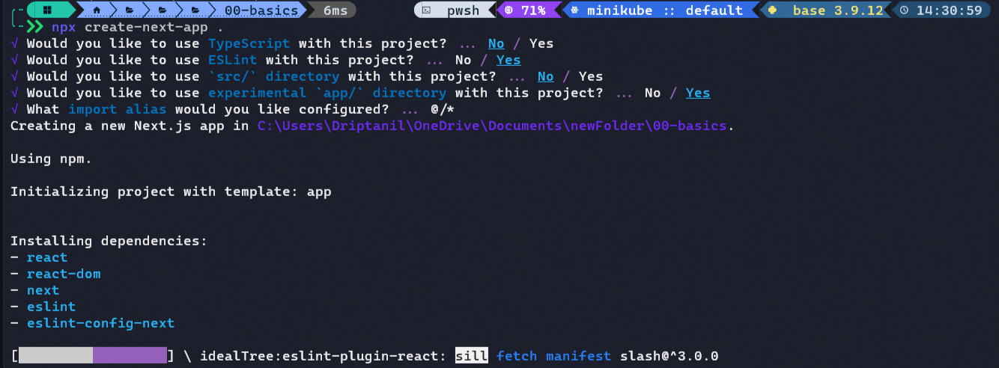

## Understanding Next.js File Structure

### `public/` directory 

- Any file placed inside this directory will be transferred to the root of the build, this usually works for static files, such as images, text files, etc.

###  `app/` directory

- Here folders are used to define routes, and the files inside these folders are used to define the UI.

#### Special Files:

-   `page.tsx` - Create the unique UI of a route and make the path publily accessible.
  
-   `layout.tsx` - Create shared UI for a segment and its children> A layout wraps a page or child segment.
  
-   `template.tsx` - Similar to `layout.tsx`, except a new componenet instance is mounted navigation. Use layouts unless you need this behavoir.

-   `error.tsx` - Create loading UI for a segment and its children.

-   `loading.tsx` - Create loading UI for a segment and its children.

-   `not-found.tsx` - The not-found file is rendered when Next.js encounters a [404 error for that page](https://www.makeuseof.com/error-404-mean/). In Next.js 12, you’d have to manually create and set up a 404 page.

-   `head.tsx` - This file specifies the head tag for the route segment it’s defined in.

## Using Experimental Feature `App` directory

### `Page.jsx`

This `page.jsx` is a Server Side Component.
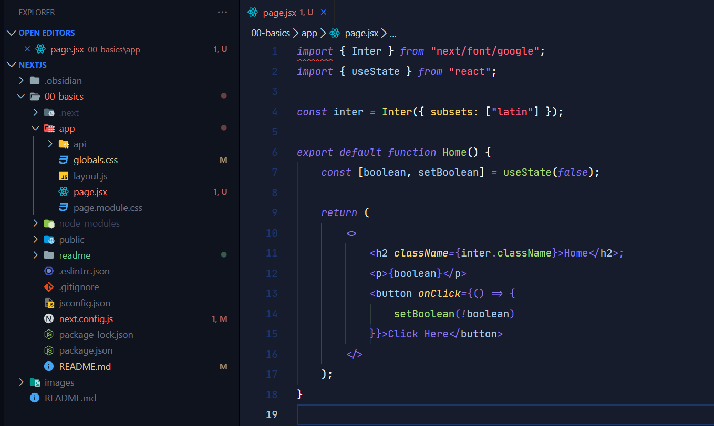

Using  `useState() hook` causes error because it is only available on Client Side Components
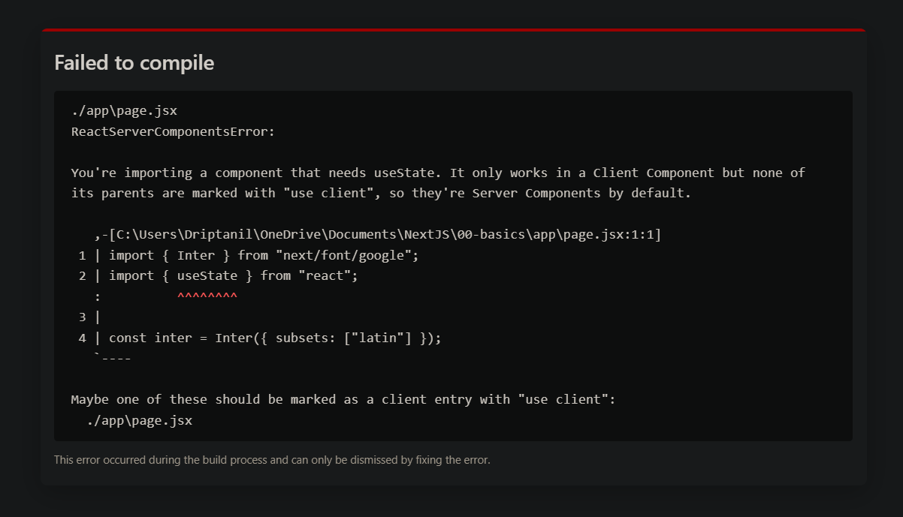

### `Layout.js`

- `layout.js` contains UI that is shared between routes.

- `page.jsx` is rendered in `layout.js` by using the `{children}` prop. 
  
  During rendering, `children` will be populated with the route segments the layout is wrapping.
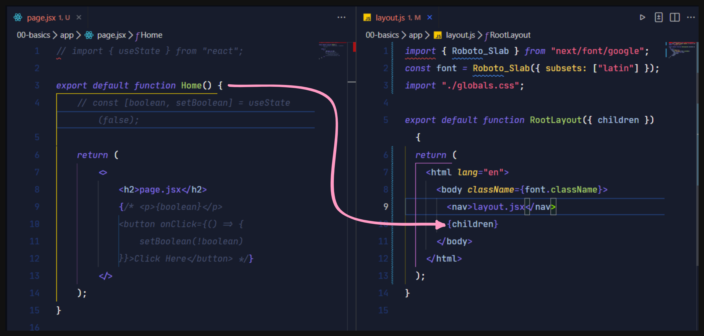

### `Loading.jsx`

- A `loading.jsx` file can create instant loading states built on [Suspense](https://beta.nextjs.org/docs/data-fetching/streaming-and-suspense).
  
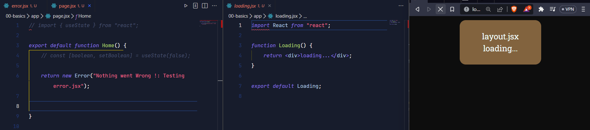

### `Error.jsx`

- An `page.jsx` file defines an error UI boundary for a route segment

- An `page.jsx` boundary will **not** handle errors thrown in a `layout.js` component in the **same** segment because the error boundary is nested **inside** that layouts component.

- `"use client"` makes this component **Client Side Rendered**
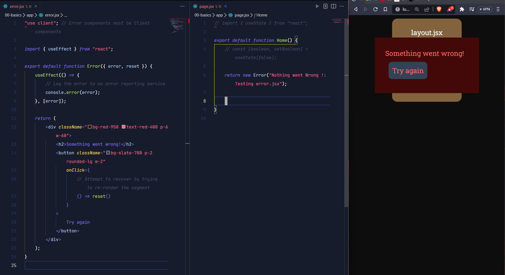

### `Not-Found.jsx`

- The `not-found.jsx` file is used to render UI when the [`notFound`](https://beta.nextjs.org/docs/api-reference/notfound) function is thrown within a route segment.

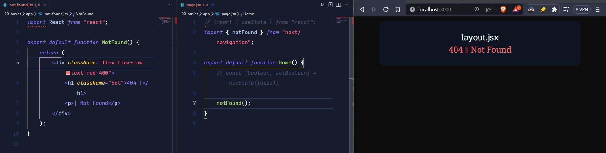

## Understanding Next.js Routing

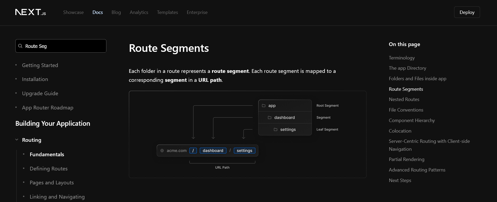

- https://beta.nextjs.org/docs/routing/fundamentals

[//]: # (![]&#40;./readme/Routing_%20Fundamentals%20_%20Next.js.png&#41;)
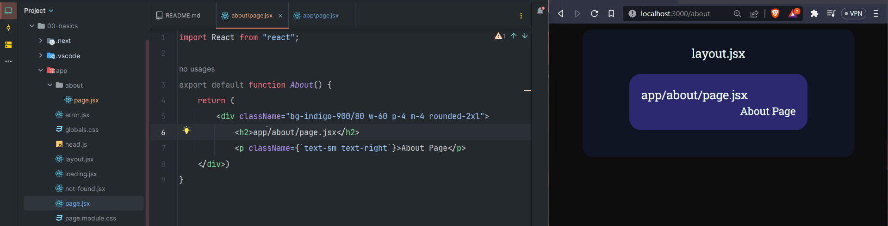

## Dynamic Routing
  - When you don't know the exact segment names ahead of time and want to create routes from dynamic data, you can use Dynamic Segments that are filled in at request time or prerendered at build time.
    Convention

  - A Dynamic Segment can be created by wrapping a folder’s name in square brackets: [folderName]. For example, [id] or [slug].

- Dynamic Segments are passed as the params prop to layout, page, route, and generateMetadata functions.

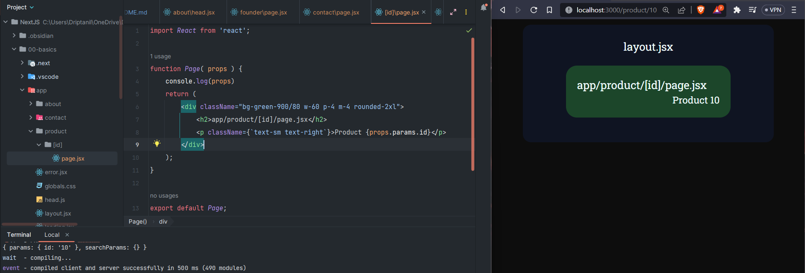

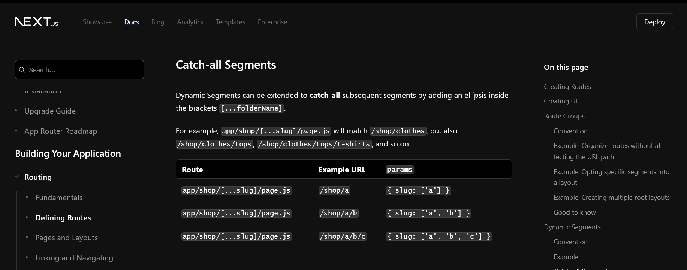
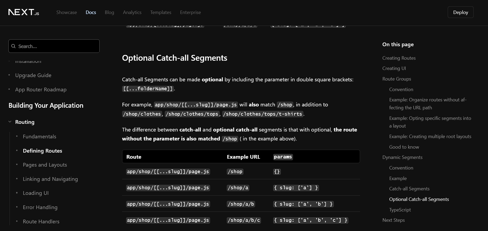

## Adding Navigation bar

- In `header.jsx`,  by using `Link` from `next/link` and using `href` attribute.
- `<Link>` is a React component that extends the HTML element to provide prefetching and client-side navigation between routes. It is the primary way to navigate between routes in Next.js.
- This `header.jsx` is imported to `layout.jsx` file, which helps it remain static while routing
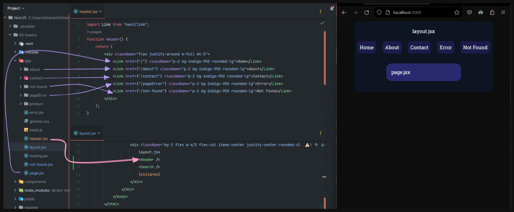

## Searching Bar

- In `search.jsx`, the `input` tag used `onChange` attribute.

- To use `onChange` attribute and `useState()` hook must be Client Side Rendered for it to work properly, `"use client";`.

- Just of organization of code files, `search.jsx` is stored `/components/clients/` 

- used **TailWindCss** component and **React-icons** for search bar UI. 
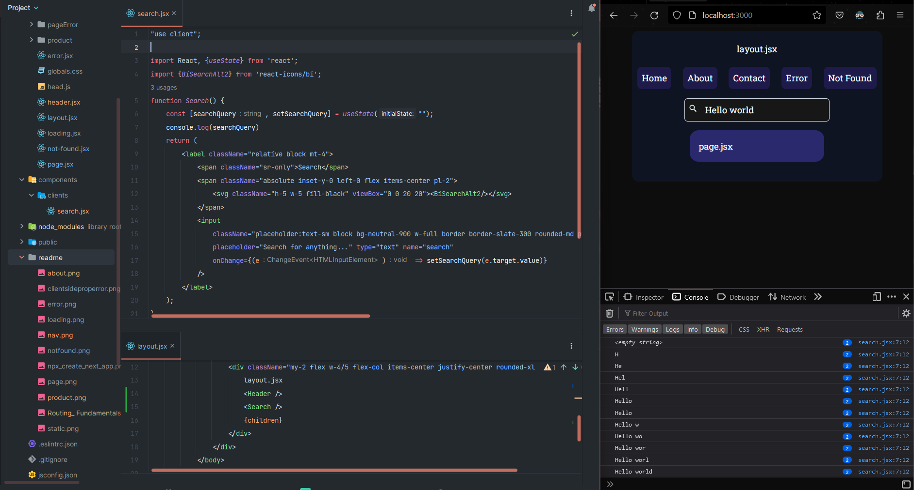

### Organizing routes without affecting the URL path

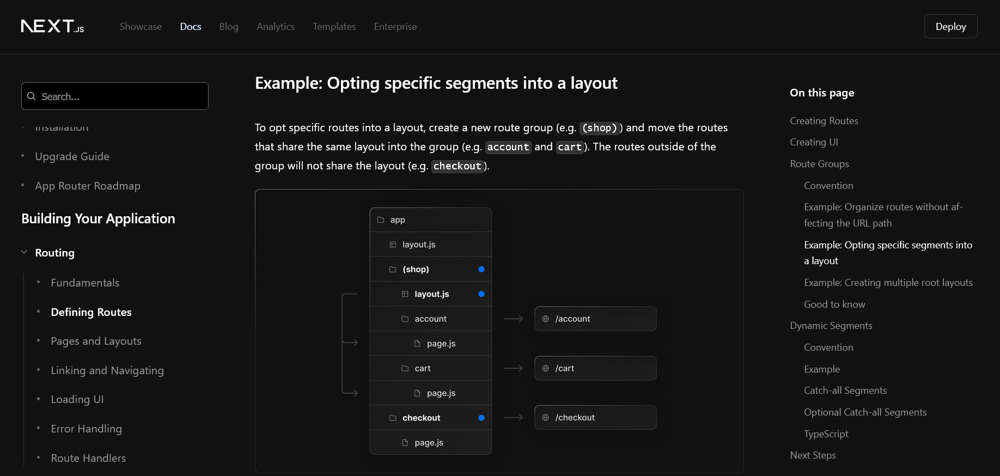
